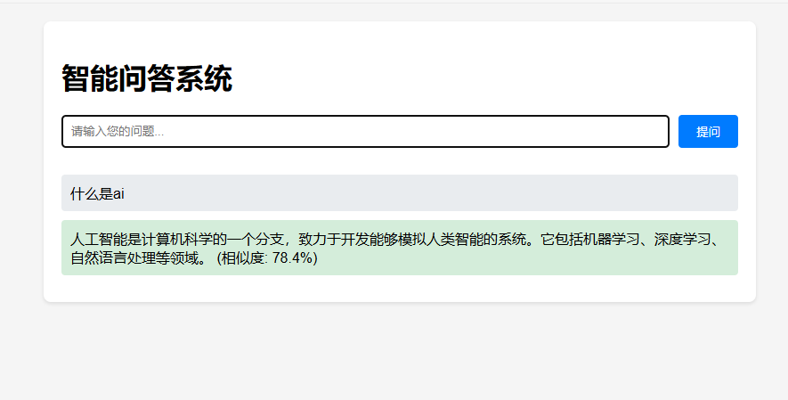
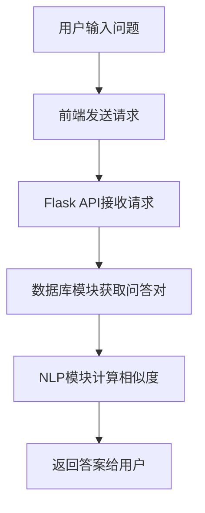

# 智能问答系统

## 摘要

本文档详细介绍了一个基于Flask框架的智能问答系统。该系统利用自然语言处理技术和数据库存储，实现了用户问题的自动回答。系统的核心组件包括数据库管理模块、NLP处理模块和Web服务接口。

## 系统架构

### 1. 系统概述

智能问答系统由以下几个主要模块组成：

- **Web服务接口**：基于Flask框架，提供HTTP API用于接收用户问题并返回答案。
- **数据库管理模块**：负责存储和检索问答对。
- **NLP处理模块**：使用预训练的语言模型计算问题的嵌入向量，并进行相似度匹配。

### 2. 技术路线

- **后端框架**：Flask
- **数据库**：SQLite
- **自然语言处理**：SentenceTransformers
- **日志管理**：Python logging模块

## 主要算法

### 1. 文本嵌入与相似度计算

#### 代码实现 
```python
def get_embedding(self, text: str) -> np.ndarray:
    """获取文本的嵌入向量"""
    if self.model is not None:
        try:
            return self.model.encode(text)
        except Exception as e:
            logger.error(f"获取嵌入向量失败: {str(e)}")
            return self.get_simple_embedding(text)
    return self.get_simple_embedding(text)

def calculate_similarity(self, embedding1: np.ndarray, embedding2: np.ndarray) -> float:
    """计算两个嵌入向量之间的余弦相似度"""
    try:
        return np.dot(embedding1, embedding2) / (np.linalg.norm(embedding1) * np.linalg.norm(embedding2))
    except Exception as e:
        logger.error(f"计算相似度失败: {str(e)}")
        return 0.0

```

#### 伪代码
```plaintext
FUNCTION get_embedding(text):
    IF model IS NOT None:
        TRY:
            RETURN model.encode(text)
        CATCH Exception:
            LOG error
            RETURN simple_embedding(text)
    RETURN simple_embedding(text)

FUNCTION calculate_similarity(embedding1, embedding2):
    TRY:
        RETURN dot_product(embedding1, embedding2) / (norm(embedding1) norm(embedding2))
    CATCH Exception:
        LOG error
        RETURN 0.0
```

### 2. 找到最相似的问答对

#### 代码实现
```python
def find_most_similar(self, query: str, candidates: List[Tuple], threshold: float = 0.5) -> Tuple[str, float]:
    query_embedding = self.get_embedding(query)
    max_similarity = 0
    best_answer = None
    for row in candidates:
        try:
            id_, question, answer, embedding_str, created_at = row
            embedding = np.array([float(x) for x in embedding_str.strip('[]').split(',')])
            similarity = self.calculate_similarity(query_embedding, embedding)
            if similarity > max_similarity:
                max_similarity = similarity
                best_answer = answer
        except Exception as e:
            logger.error(f"处理嵌入向量时出错: {str(e)}")
            continue
    if max_similarity < threshold:
        return None, 0
    return best_answer, max_similarity

```

#### 伪代码
```plaintext
FUNCTION find_most_similar(query, candidates, threshold=0.5):
    query_embedding = get_embedding(query)
    max_similarity = 0
    best_answer = None
    FOR each row IN candidates:
        TRY:
            id, question, answer, embedding_str, created_at = row
            embedding = parse_embedding(embedding_str)
            similarity = calculate_similarity(query_embedding, embedding)
            IF similarity > max_similarity:
                max_similarity = similarity
                best_answer = answer
        CATCH Exception:
            LOG error
            CONTINUE
    IF max_similarity < threshold:
        RETURN None, 0
    RETURN best_answer, max_similarity

```

## 数据流

1. 用户通过Web界面输入问题。
2. 前端通过AJAX请求将问题发送到Flask API。
3. API调用数据库模块获取所有问答对。
4. NLP模块计算用户问题与数据库中问题的相似度。
5. 返回最相似的答案给用户。

## 界面截图



## 流程图



## 数据库表结构
```sql
CREATE TABLE IF NOT EXISTS qa_pairs (
    id INTEGER PRIMARY KEY,
    question TEXT NOT NULL,
    answer TEXT NOT NULL,
    embedding TEXT,
    created_at TIMESTAMP DEFAULT CURRENT_TIMESTAMP
);

```

## 部署与运行

### 环境要求

- Python 3.7+
- Flask
- SQLite
- SentenceTransformers

### 部署步骤

1. 克隆项目代码。
2. 安装依赖库：`pip install -r requirements.txt`
3. 初始化数据库：运行`init_data.py`。
4. 启动Flask服务：`python app.py`

## 结论

该智能问答系统通过结合数据库和NLP技术，实现了高效的问答匹配。未来的工作可以进一步优化模型性能和扩展问答库。

